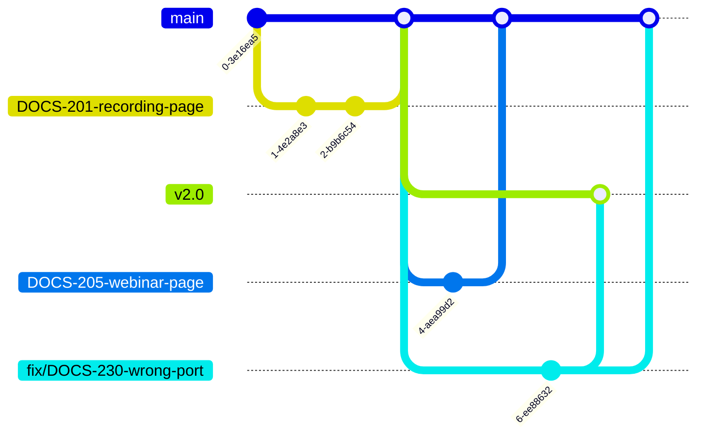

# A branching and merge-request workflow for a documentation team

On a versioned documentation site, every change needs a routing decision: does it belong to the unreleased next version, to one published version, or to several versions at once?
This article explains a branching and merge-request workflow that encodes the decision in four branch roles, so writers route changes correctly without being Git experts.

This article is for documentation leads who design a Git workflow for versioned documentation.
After reading it, you can adapt the branch roles, the fix-branch rule, and the merge policies to your own team, and justify each choice.

The examples use the documentation repositories of a fictional product, Red Apple Conference, modeled on a real platform.

## One site, three kinds of changes

A documentation team for a versioned product handles three kinds of changes:

- **Next-release documentation.** Writers document new features before they ship. Reviewers and the staging site must see these pages; readers must not.
- **A fix in one published version.** A wrong value in the documentation of a released version must reach readers now, not with the next release.
- **A fix in several versions.** An error that entered the site in version 2.0 usually exists in 2.1 and in the unreleased documentation too, and the fix must land everywhere it applies.

A single shared branch can't serve all three: either unreleased content leaks to readers, or published fixes wait for a release.
The workflow gives each kind of change its own route.

## Branch roles

Every content repository uses the same four branch roles:

| Branch | Role |
|---|---|
| `main` | Documentation for the next, unreleased version. Builds only the staging site. |
| `v2.0`, `v2.1`, … | Documentation of one published version each. Build the production and staging sites and fill the version selector. |
| `DOCS-201-recording-page` | One writer's work on one task. Created from `main`, merged back into `main`. |
| `fix/DOCS-230-wrong-port` | A fix for published documentation. Created from a release branch, merged into every affected branch. |

`main` and the release branches are protected: nobody pushes to them directly, every change arrives as a reviewed merge request, and only a maintainer merges it.
Task and fix branches are short-lived and belong to one writer.

## Where does a change start?

The branch a change starts from, and the branches it must reach, follow from what you're changing:

| You are changing | Create your branch from | Open merge requests into |
|---|---|---|
| Documentation for the next, unreleased version | `main` | `main` |
| Documentation of one published version | The affected release branch | The affected release branch |
| Documentation of several versions, possibly including `main` | The oldest affected release branch | Each affected branch, one merge request per branch |

The first row is everyday writing work.
The other two follow the fix-branch rule, explained after the everyday case.

## Work on the next release

Every change starts as a task in the issue tracker, and the task ID follows the change everywhere: `DOCS-201` appears in the branch name, in the commit messages, and in the merge request title.
Six months later, any line on the site still traces back to the task that introduced it.

The writer creates the task branch `DOCS-201-recording-page` from `main`, commits, and opens a merge request back into `main` with a fixed set of conventions:

- The title repeats the task ID and a short summary, such as `DOCS-201 Describe call recording`.
- The writer assigns the merge request to themselves and picks a reviewer.
- The writer selects **Squash commits**, so the task lands on `main` as one commit.
- The writer selects **Delete source branch**, so merged branches don't pile up.
- The pipeline must pass before the reviewer starts reading.

The reviewer reads the change as a live preview site rather than a raw diff, approves, and a maintainer merges.

When the product version ships, a maintainer creates the next release branch, such as `v2.1`, from `main` in the GitLab UI—release branches are protected, so nobody can push them from a local clone.
From that moment, `main` means the release after that.

## Fix a published release

Fixes follow one rule: create the fix branch from the **oldest** affected release branch, and open one merge request per affected branch.

Suppose `DOCS-230` reports a wrong port number that appears in versions 2.0 and 2.1 and in the unreleased documentation.
The writer creates `fix/DOCS-230-wrong-port` from `v2.0` and opens three merge requests: into `v2.0`, into `v2.1`, and into `main`.

The rule works because release branches grow from `main` one after another, so a newer branch already contains the history of an older one.
A branch created from `v2.0` usually adds only the fix commits when merged into `v2.0`, `v2.1`, or `main`, keeping every merge request close to a fix-only diff.
The exception: commits that landed in the source release branch after the newer branches diverged—such as an earlier fix applied only to that version—ride along with your branch.
Before merging, check that the merge request diff contains only your fix.

:::warning
Branch from the oldest affected release, not the newest.
A fix branch created from `v2.1` carries all of version 2.1's content with it, and merging it into `v2.0` publishes that content in the older version's documentation.
:::

One habit changes for multi-target fixes: leave **Delete source branch** cleared until the last merge request, because all of them merge the same branch.

## One squash policy doesn't fit every merge

In the versioned repositories, every merge request lands as a single squashed commit.
The history of `main` and of every release branch then reads as a changelog of tasks, titled with their task IDs, and each merged fix is one commit—exactly the unit that recovery needs.

The platform's two unversioned repositories—the site homepage and the blog—pair `dev` and `main` instead: `dev` builds the staging site, `main` builds production, and publishing means merging `dev` into `main`.
That merge request carries a batch of unrelated tasks, not one task, so it isn't squashed.
Squashing would flatten the batch into one anonymous commit, and because a squashed merge leaves the two branches without shared history, Git offers the same changes—and the same conflicts—again on the next publish.

The policy, then: squash a branch that carries one task; merge a branch that carries a stream of work normally.

## When a change lands wrong

Most workflow mistakes have the same recovery tool: `git cherry-pick` copies a commit onto another branch.
Squashed merges make it practical, because every merged task or fix is exactly one commit to pick.

- **Commits pushed to the wrong branch.** Create the right branch, cherry-pick the commits onto it, then delete the mistaken ones.
- **A fix branch created from the wrong release.** Create a new branch from the oldest affected release, cherry-pick the fix commits, and reopen the merge requests.
- **A fix branch deleted too early.** Someone selected **Delete source branch** before every target got its merge request. The merged target already holds the squashed fix commit: cherry-pick it into a new branch and open the remaining merge requests from there.

:::tip
GitLab can cherry-pick without a local checkout: open the commit page, select **Options > Cherry-pick**, choose the target branch, and let GitLab start the merge request for you.
:::

## How the workflow drives the site

Each branch role doubles as a publishing rule in the platform's CI:

- **Merging into `main` rebuilds the staging site**, where the team reviews unreleased documentation in the context of the whole site.
- **Merging into a release branch rebuilds production**, so a fix reaches readers minutes after approval, independent of any product release.
- **Creating a release branch publishes the version.** The site build discovers `v*` branches automatically and adds the new one to the version selector, so releasing documentation is a Git operation, not a configuration change.
- **Opening a merge request deploys a preview**, which is the rendered site the reviewer reads.

The reference [GitLab CI pipeline for an Antora documentation repository](05-gitlab-ci-pipeline-reference.md) documents the jobs and rules that implement this routing.
The article [How a multi-repository Antora documentation platform fits together](01-antora-multi-repo-platform.md) describes the platform they feed.

## Next steps

- [Version your documentation with Antora branches](02-antora-versioning-tutorial.md): build the branch-per-version mechanics this workflow relies on.
- [Set up per-merge-request preview environments with GitLab Review Apps](03-gitlab-review-apps-previews.md): give reviewers the live preview behind the review step.
- [GitLab CI pipeline for an Antora documentation repository: a reference](05-gitlab-ci-pipeline-reference.md): look up the rules that read these branch names.
