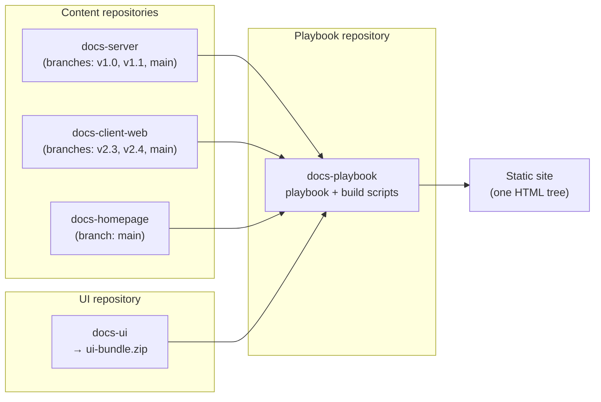

# How a multi-repository Antora documentation platform fits together

A multi-repository Antora platform builds one documentation site from many Git repositories.
Each product component keeps its documentation in its own repository.
A central build assembles the components into a single site with shared navigation, search, design, and a version selector for every component.

This article is for technical writers and documentation leads who are evaluating Antora for a product with many components.
After reading it, you can name the moving parts of such a platform and decide whether the architecture fits your product.

## One product, many components, one site

This article uses a fictional product, Red Apple Conference.
It ships a server, a web client, mobile clients, and several more components, each with its own release cycle and version numbers.
Readers expect a single site with one address, one search box, and documentation that matches the component version they run.

A single documentation repository struggles here.
Component releases happen on different dates, so no single branch can represent a release of the whole site.
Per-component versioning becomes a naming convention instead of something the tooling enforces.
Independent per-component sites fix versioning but break the reader's experience: search stops at component boundaries, and design drifts apart.

Antora resolves this tension by design.
Content lives in as many repositories as you need while one central build produces a single coherent site.
The platform this series is based on assembles about 15 repositories; the examples in this article trim that to three.

## Key terms

The series uses standard Antora terminology:

| Term | Meaning                                                                                                                                       |
|---|-----------------------------------------------------------------------------------------------------------------------------------------------|
| Component | One documentation unit, typically matching one product component. Defined by an `antora.yml` file in its repository.                          |
| Version | One version of a component. Antora treats each Git branch or tag listed in the playbook as a version.                                         |
| Module | A folder that groups pages inside a component. Every component has at least one module.                                                       |
| Playbook | The YAML file that configures a site build: which content repositories and branches to collect, which UI to apply, where to write the output. |
| UI bundle | A zip archive with the site's templates, styles, and scripts. Antora applies it to every page at build time.                                  |

## The moving parts

The platform consists of three kinds of repositories, each with one job:



### Content repositories

Each product component keeps its documentation in its own repository, for example `docs-server`, `docs-client-web`, and `docs-client-ios`.

A repository contains AsciiDoc pages, images, and an `antora.yml` descriptor that names the component and its version.
Branches carry the versions: each `v*` branch listed in the playbook becomes one entry in the site's version selector.

The central site is only one consumer of these repositories.
Each repository is a complete Antora component, so a pipeline can also build it on its own.
Red Apple Conference relies on this independence: the product ships one component's documentation as built-in help.
The component's own pipeline builds this help with the same UI bundle and a few product-specific style overrides.

### The UI repository

A single repository, `docs-ui`, owns the site's look.

Antora's default UI already provides the page layout, navigation, and the component version selector.
This repository is a customized copy of the default UI, adapted to the product.
Its continuous integration (CI) pipeline builds the theme into one artifact, `ui-bundle.zip`.
Every site build applies this bundle to every page, which keeps 15 components visually identical.

### The playbook repository

The central repository, `docs-playbook`, is where a site build starts.
It holds no documentation content—only the playbook files and build scripts.
The playbook tells Antora what to assemble.

Here is the production playbook, trimmed to three sources:
```yaml
site:
  title: Red Apple Conference Documentation
  url: https://docs.example.com
content:
  branches: [ v* ]
  sources:
    - url: https://git.example.com/docs/docs-server
    - url: https://git.example.com/docs/docs-client-web
    - url: https://git.example.com/docs/docs-homepage
      branches: [main]
ui:
  bundle:
    url: ./build/ui-bundle.zip
antora:
  extensions:
    - require: '@antora/lunr-extension'
      languages: [en]
      index_latest_only: true
```

The `content.sources` list is the central piece of configuration.
To add a component to the site, you add a line with one new `url` entry.
The component team's repository stays untouched.

## How a build assembles the site

A full site build always starts in the playbook repository and runs the same way in CI and locally.

1. Antora reads the playbook and fetches every source.
   For each repository it collects the listed branches; each branch becomes one version of that component, named by the `antora.yml` descriptor on that branch.
2. Antora applies the UI bundle, and the Lunr extension builds the search index.
   Every page gets the same templates and styles, and the index covers the latest version of each component.
   Searches run in the reader's browser, so the site needs no search server.
3. The result lands in one output directory, `build/site` by default.
   The site is a plain static HTML tree, so any static file host can serve it.

The important property of this flow: a component's documentation version exists the moment its `v*` branch exists.
Releasing documentation for a new version is a Git operation in the component repository, not a configuration change in the platform.

Pages can also link across components without hard-coded URLs.
A page in `docs-server` references a page in `docs-client-web` by Antora page ID, using the `xref` macro.
Antora resolves every page ID to a URL at build time.

## Development and production builds

The platform builds two variants of the site from two playbooks: `antora-playbook.dev.yml` and `antora-playbook.prod.yml`.
The dev build publishes the staging site, where the team reviews work in progress.
The prod build publishes the production site, which readers see.

The playbooks differ only where the two environments must differ, for example:

| Setting | Dev | Prod |
|---|---|---|
| `site.url` | `https://docs-staging.example.com` | `https://docs.example.com` |
| Collected branches | `main` and `v*` | `v*` only |
| UI bundle | built from the UI repo's `dev` branch | built from the UI repo's `main` branch |
| Analytics | off | on |

The branch difference is the one that matters most.
The staging site includes every component's `main` branch, so writers see unreleased documentation next to released versions.
The production site collects only `v*` branches, so nothing unreleased can reach readers.

Two content repositories are special.
The site homepage and the blog each live in their own repository, with their own design.
They aren't versioned: instead of `v*` branches, they follow the platform's `dev`/`main` branch logic. 

Keeping two playbooks instead of one parameterized file is a deliberate trade-off.
A two-file diff shows every difference between staging and production, but shared changes, such as a new content source, go into both files.

## Where automation fits

Two pieces of automation keep the platform running; each one has its own article in this series.

Content repositories trigger the central build.
A pipeline in each content repository validates the component and then triggers the playbook repository: a push to `main` rebuilds the staging site, and a push to a `v*.*` branch rebuilds staging and production.
The reference *GitLab CI pipeline for an Antora documentation repository* (SOON!) will document this pipeline job by job.

Merge requests get previews.
Every merge request in a content repository deploys its own temporary preview environment, linked from the merge request, and the preview expires automatically.
The how-to [Set up per-merge-request preview environments with GitLab Review Apps](03-gitlab-review-apps-previews.md) shows the setup.

## When this architecture is worth it

The architecture earns its complexity when three things are true: 
1. Your product has several components that version independently.
2. Readers need them on one site.
3. Someone can own the central machinery—the playbook repository, the UI bundle, and the CI that ties them together.

It's the wrong choice for a single-component product, where plain single-repository Antora or a simpler generator does the job with none of the coordination cost.
It's also questionable if all components release in lockstep: one repository with one set of version branches is easier to operate.

## Next steps

- [Version your documentation with Antora branches](02-antora-versioning-tutorial.md): build a two-version site with a version selector, hands-on.
- [Set up per-merge-request preview environments with GitLab Review Apps](03-gitlab-review-apps-previews.md): add preview links to your merge requests.
- *GitLab CI pipeline for an Antora documentation repository: a reference* (SOON!): look up any job, variable, or rule in the content-repo pipeline.
