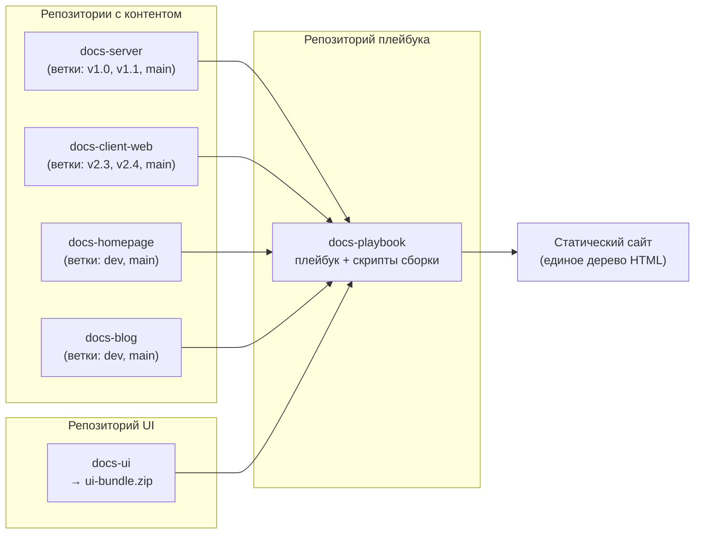

# Как устроена платформа документации на Antora

Платформа документации на Antora собирает один сайт из множества Git-репозиториев.
Документация каждого компонента продукта хранится в отдельном репозитории.
Центральная сборка объединяет компоненты в один сайт с общими навигацией, поиском и оформлением.
У каждого компонента на сайте есть переключатель версий.

Статья — для технических писателей и руководителей команд документации, которые оценивают Antora как платформу для многокомпонентного продукта.
Вы узнаете, из каких частей состоит такая платформа, и сможете решить, подходит ли эта архитектура вашему продукту.
Статья описывает только архитектуру платформы.
Подробнее об Antora и настройке плейбуков — в [официальной документации Antora](https://docs.antora.org).

## Один продукт, много компонентов, один сайт

В статье используется вымышленный продукт Red Apple Conference, созданный по образцу реальной платформы.
Продукт состоит из сервера, веб-клиента, мобильных клиентов и еще нескольких компонентов.
У каждого компонента свой цикл выпуска и свои номера версий.
Читатели ожидают один сайт с одним адресом, одной строкой поиска и документацией к той версии компонента, которая у них установлена.

Если хранить всю документацию в одном репозитории, компоненты сложно версионировать независимо.
Каждая ветка Git содержит документацию всех компонентов, хотя выпускаются они по отдельности.
Отдельный сайт для каждого компонента решает эту проблему, но дробит документацию: поиск работает только в пределах компонента, а оформление сайтов со временем расходится.

Antora решает эту проблему на уровне архитектуры: контент хранится в любом количестве репозиториев, а центральная сборка собирает из него один сайт.
Реальная платформа, на которой основан цикл, собирает контент более чем из 15 репозиториев.
В примерах статьи их четыре.

## Основные термины

В цикле используется стандартная терминология Antora:

| Термин | Значение |
|---|---|
| Компонент | Единица документации, которая обычно соответствует одному компоненту продукта. Задается файлом `antora.yml` в репозитории компонента. |
| Версия | Одна версия компонента. Antora считает версией каждую указанную в плейбуке ветку или тег Git. |
| Модуль | Директория со страницами внутри компонента. В каждом компоненте есть хотя бы один модуль. |
| Плейбук | YAML-файл с настройками сборки сайта: какие репозитории с контентом и ветки собирать, какой UI применить и куда записать результат. |
| UI-бандл | ZIP-архив с шаблонами, стилями и скриптами сайта. При сборке Antora применяет его к каждой странице. |

## Состав платформы

Платформа состоит из репозиториев трех типов, у каждого — своя задача:



### Репозитории с контентом

Документация каждого компонента продукта хранится в отдельном репозитории, например `docs-server`, `docs-client-web` или `docs-client-ios`.

Репозиторий содержит страницы AsciiDoc, изображения и дескриптор `antora.yml` с именем и версией компонента.
Версии хранятся в ветках: каждая указанная в плейбуке ветка `v*` появляется в переключателе версий на сайте.

Эти репозитории использует не только центральный сайт.
Каждый репозиторий — самостоятельный компонент Antora, поэтому его можно собрать и отдельно, в собственном пайплайне.
Red Apple Conference этим пользуется: документация одного из компонентов поставляется вместе с продуктом как встроенная справка.
Пайплайн компонента собирает эту справку с тем же UI-бандлом и несколькими переопределениями стилей для продукта.

Два репозитория с контентом устроены иначе.
Главная страница сайта и блог хранятся в репозиториях `docs-homepage` и `docs-blog` и используют собственные макеты страниц из общего UI-бандла.
Они не версионируются: вместо веток `v*` в них есть ветка `dev` для тестового сайта и ветка `main` для продакшн-сайта.

### Репозиторий UI

Оформление сайта хранится в одном репозитории — `docs-ui`.

Стандартный UI Antora уже содержит макет страниц, навигацию и переключатель версий компонентов.
Этот репозиторий — копия стандартного UI, доработанная под продукт.
Пайплайн этого репозитория собирает тему оформления в один артефакт — `ui-bundle.zip`.
Каждая сборка сайта применяет этот бандл ко всем страницам, поэтому документация всех компонентов продукта выглядит одинаково.

### Репозиторий плейбука

Сборка сайта начинается в центральном репозитории `docs-playbook`.
В нем нет контента документации — только файлы плейбуков и скрипты сборки.
Плейбук указывает Antora, что собирать.

Сокращенный продакшн-плейбук с четырьмя источниками:

```yaml
site:
  title: Red Apple Conference Documentation
  url: https://docs.example.com
content:
  branches: [v*]
  sources:
    - url: https://git.example.com/docs/docs-server
    - url: https://git.example.com/docs/docs-client-web
    - url: https://git.example.com/docs/docs-homepage
      branches: [main]
    - url: https://git.example.com/docs/docs-blog
      branches: [main]
ui:
  bundle:
    url: ./build/ui-bundle.zip
antora:
  extensions:
    - require: '@antora/lunr-extension'
      languages: [en]
      index_latest_only: true
```

Общее значение `content.branches: [v*]` действует для версионируемых компонентов.
Для `docs-homepage` и `docs-blog` оно переопределено на уровне источника (`branches: [main]`): главная страница и блог публикуются на продакшн-сайте из ветки `main`.

Список `content.sources` — центральная часть конфигурации.
Чтобы добавить компонент на сайт, достаточно одной строки с новым `url`.

## Как сборка формирует сайт

Полная сборка сайта всегда запускается из репозитория плейбука — в системе непрерывной интеграции (CI) или локально.

1. Antora читает плейбук и загружает каждый источник.
   Из каждого репозитория она берет перечисленные ветки.
   Каждая ветка становится версией компонента, а имя версии задает дескриптор `antora.yml` в этой ветке.
2. Antora применяет UI-бандл, а расширение Lunr строит поисковый индекс.
   Все страницы получают одинаковые шаблоны и стили, а индекс охватывает последнюю версию каждого компонента.
   Поиск работает в браузере читателя, поэтому поисковый сервер сайту не нужен.
3. Antora записывает результат в одну выходную директорию — по умолчанию `build/site`.
   Сайт — обычное статическое дерево HTML, его можно разместить на любом хостинге статических файлов.

Плейбук собирает ветки, которые соответствуют шаблону `v*`.
Поэтому новая ветка `v*` в репозитории компонента автоматически становится новой версией документации при следующей сборке.
Конфигурацию платформы для этого менять не нужно.

Страницы могут ссылаться на другие компоненты без жестко заданных URL.
Например, страница из `docs-server` ссылается на страницу из `docs-client-web` макросом `xref` по идентификатору страницы.
При сборке Antora превращает каждый идентификатор страницы в URL.

## Dev- и prod-сборки

Платформа собирает два варианта сайта по двум плейбукам: `antora-playbook.dev.yml` и `antora-playbook.prod.yml`.
Dev-сборка публикует тестовый сайт, на котором команда проверяет незавершенную работу.
Prod-сборка публикует продакшн-сайт для читателей.

Плейбуки различаются только там, где тестовый и продакшн-сайт должны отличаться, например:

| Параметр | Dev-сборка | Prod-сборка |
|---|---|---|
| `site.url` | `https://docs-staging.example.com` | `https://docs.example.com` |
| Ветки компонентов продукта | `main` и `v*` | только `v*` |
| UI-бандл | из ветки `dev` репозитория UI | из ветки `main` репозитория UI |
| Аналитика | выключена | включена |

Главное различие — в наборе веток.
Тестовый сайт включает ветку `main` каждого компонента продукта, поэтому технические писатели видят невыпущенную документацию рядом с опубликованными версиями.
Продакшн-сайт собирает компоненты продукта только из веток `v*`, поэтому невыпущенная документация не попадает к читателям.

Два плейбука вместо одного параметризованного файла — сознательный компромисс.
Так все настройки каждого сайта наглядно видны в своем файле.
Но общие изменения, например новый источник контента, приходится вносить в оба файла.

## Автоматизация

Работу платформы поддерживают два основных механизма автоматизации.

Репозитории с контентом запускают центральную сборку.
Пайплайн каждого такого репозитория проверяет компонент, а затем запускает пайплайн репозитория плейбука.
Пуш в `main` пересобирает тестовый сайт, а пуш в ветку версии, например `v1.1`, — тестовый и продакшн-сайт.

Мердж-реквесты получают превью.
Для каждого мердж-реквеста в репозитории с контентом пайплайн разворачивает временное окружение, а GitLab добавляет в мердж-реквест ссылку на превью.
Превью удаляется автоматически.
Настройка описана в руководстве [«Настройка превью мердж-реквестов с помощью GitLab Review Apps»](03-gitlab-review-apps-previews.md).

## Когда стоит использовать эту архитектуру

Сложность этой архитектуры окупается при трех условиях:

1. Продукт состоит из нескольких компонентов с независимым версионированием.
2. Читателям нужна документация по всем компонентам на одном сайте.
3. Есть человек, который может отвечать за центральную инфраструктуру: репозиторий плейбука, UI-бандл и связывающий их CI.

Для продукта из одного компонента эта архитектура не подходит: Antora с одним репозиторием или более простой генератор сайтов решат задачу без затрат на координацию.
Она может быть избыточной и тогда, когда все компоненты выпускаются одновременно: один репозиторий с общим набором веток версий проще поддерживать.

## Что дальше

- [Версионирование документации в Antora с помощью веток](02-antora-versioning-tutorial.md) — пройдите туториал и соберите сайт с двумя версиями и переключателем версий.
- [Настройка превью мердж-реквестов с помощью GitLab Review Apps](03-gitlab-review-apps-previews.md) — добавьте в мердж-реквесты ссылки на превью.
